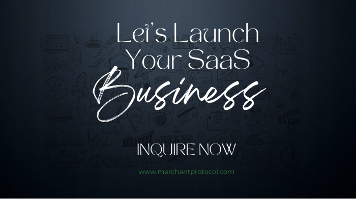

<p align="center">
  
</p>

<h1 align="center">AWS CloudFormation Templates</h1>

<p align="center">
  Production-ready, SOC 2 Type II compliant infrastructure-as-code for AWS.
</p>

<p align="center">
  <a href="LICENSE"></a>
  <a href="https://aws.amazon.com/cloudformation/"></a>
  <a href="docs/SOC2-CONTROL-MATRIX.md"></a>
  <a href="https://github.com/merchantprotocol/aws-cloudformation-templates/actions/workflows/validate-templates.yml"></a>
  <br>
  <a href="https://github.com/merchantprotocol/aws-cloudformation-templates/stargazers"></a>
  <a href="https://github.com/merchantprotocol/aws-cloudformation-templates/issues"></a>
  <a href="https://github.com/merchantprotocol/aws-cloudformation-templates/pulls"></a>
  <a href="https://github.com/merchantprotocol/aws-cloudformation-templates/commits/main"></a>
</p>

<p align="center">
  <a href="#quick-start">Quick Start</a> &bull;
  <a href="#soc-2-compliance">SOC 2 Compliance</a> &bull;
  <a href="docs/DEPLOYMENT-GUIDE.md">Deployment Guide</a> &bull;
  <a href="CONTRIBUTING.md">Contributing</a>
</p>

---

## What This Deploys

A complete, hardened VPC environment with:

- **Network** — VPC with public/private subnets across 2 AZs, NAT Gateways, Internet Gateway
- **Compute** — Auto-scaling web app instances in private subnets, bastion host for SSH access
- **Load Balancer** — Application Load Balancer with HTTPS (TLS 1.3), automatic HTTP-to-HTTPS redirect
- **Database** — Aurora MySQL Serverless v2 (encrypted at rest and in transit, 35-day backups, deletion protection)
- **Storage** — Encrypted EFS with automatic backups and mount targets in both AZs
- **Monitoring** — VPC Flow Logs, CloudTrail with encrypted S3 storage, CloudWatch alarms
- **Security** — Least-privilege IAM roles, scoped KMS keys with rotation, IMDSv2 enforcement, restricted security groups

```
Internet ──▶ ALB (HTTPS) ──▶ Web App (private subnet, auto-scaling 2-4)
                                  │
                                  ├──▶ Aurora MySQL (private, encrypted, TLS enforced)
                                  └──▶ EFS (private, encrypted, backups enabled)

Your IP ──▶ Bastion (restricted SSH) ──▶ Web App / DB tunnel
```

## Templates

| Template | Description | Use Case |
|----------|-------------|----------|
| [`cloudformation-launchtemplates-soc2.yaml`](vpc-standard-2privatesubnets/cloudformation-launchtemplates-soc2.yaml) | SOC 2 Type II compliant | **Recommended for production** |
| [`cloudformation-launchtemplates.yaml`](vpc-standard-2privatesubnets/cloudformation-launchtemplates.yaml) | Standard (hardened) | Non-regulated environments |
| [`cloudformation-template.yaml`](vpc-standard-2privatesubnets/cloudformation-template.yaml) | Legacy (Launch Configurations) | Deprecated — do not use |

## Quick Start

### Prerequisites

You need two things before deploying:

1. **SSL Certificate** — Go to [AWS Certificate Manager](https://console.aws.amazon.com/acm), request a certificate for your domain, complete DNS validation, and copy the ARN
2. **EC2 Key Pair** — Go to [EC2 > Key Pairs](https://console.aws.amazon.com/ec2#KeyPairs), create one, and save the `.pem` file

### Deploy via AWS Console

1. Go to [CloudFormation > Create Stack](https://console.aws.amazon.com/cloudformation#/stacks/create)
2. Upload `cloudformation-launchtemplates-soc2.yaml`
3. Fill in **Section 1** (4 required fields: SSL cert ARN, key pair, database password, your IP for SSH)
4. Review defaults in Sections 2-5 (all have sensible defaults)
5. Check the IAM acknowledgment box and create the stack

### Deploy via CLI

```bash
aws cloudformation create-stack \
  --stack-name my-web-app \
  --template-body file://vpc-standard-2privatesubnets/cloudformation-launchtemplates-soc2.yaml \
  --parameters \
    ParameterKey=SSLCertificateArn,ParameterValue=arn:aws:acm:us-east-1:123456789:certificate/abc-123 \
    ParameterKey=KeyPair,ParameterValue=my-key-pair \
    ParameterKey=DBMasterUserPassword,ParameterValue='MyP@ssw0rd!' \
    ParameterKey=BastionAllowedCIDR,ParameterValue=203.0.113.25/32 \
  --capabilities CAPABILITY_NAMED_IAM
```

Deployment takes ~15-20 minutes. See the [Deployment Guide](docs/DEPLOYMENT-GUIDE.md) for post-deployment steps.

## SOC 2 Compliance

<table>
<tr>
<td>

### Trust Service Criteria Coverage

| Category | Controls |
|----------|---------|
| **CC6 — Access Controls** | VPC isolation, restricted security groups, IAM roles, KMS encryption, IMDSv2, TLS everywhere |
| **CC7 — Monitoring** | VPC Flow Logs, CloudTrail, CloudWatch alarms, log integrity validation |
| **CC8 — Change Management** | Infrastructure as Code, drift detection, auto-patching |
| **A1 — Availability** | Multi-AZ, auto-scaling, 35-day backups, deletion protection |

</td>
<td>

### Encryption Everywhere

| Layer | At Rest | In Transit |
|-------|:-------:|:----------:|
| Web Traffic | — | TLS 1.3 |
| Database | KMS | TLS enforced |
| File Storage | KMS | TLS enforced |
| Audit Logs | KMS + S3 SSE | HTTPS only |
| Flow Logs | KMS | HTTPS |

</td>
</tr>
</table>

### Compliance Documentation

| Document | Description |
|----------|-------------|
| [SOC 2 Control Matrix](docs/SOC2-CONTROL-MATRIX.md) | Maps each TSC to specific template resources — **start here for audits** |
| [Architecture Overview](docs/ARCHITECTURE-OVERVIEW.md) | Network diagrams, traffic flows, encryption summary |
| [Evidence Collection Guide](docs/EVIDENCE-COLLECTION-GUIDE.md) | AWS CLI commands to collect every piece of audit evidence |
| [Access Management Procedure](docs/ACCESS-MANAGEMENT-PROCEDURE.md) | Granting, reviewing, and revoking access |
| [Change Management Procedure](docs/CHANGE-MANAGEMENT-PROCEDURE.md) | How infrastructure changes are proposed, reviewed, and deployed |
| [Incident Response Procedure](docs/INCIDENT-RESPONSE-PROCEDURE.md) | Detection, triage, investigation, and remediation |
| [Backup and Recovery Procedure](docs/BACKUP-AND-RECOVERY-PROCEDURE.md) | Backup inventory, recovery steps, RTO/RPO targets |
| [Monitoring and Alerting Procedure](docs/MONITORING-AND-ALERTING-PROCEDURE.md) | What's monitored, alert response, log review schedules |
| [Deployment Guide](docs/DEPLOYMENT-GUIDE.md) | Step-by-step deployment and update instructions |
| [Shared Responsibility Model](docs/SHARED-RESPONSIBILITY-MODEL.md) | AWS vs. your responsibilities per service |

## Parameters

The Console groups parameters into numbered sections so you only need to focus on Section 1:

| Section | Parameters | Action Required |
|---------|-----------|----------------|
| **1. Required** | SSL certificate, key pair, DB password, SSH IP range | **Fill these in** |
| 2. Application Settings | DB name, username, instance sizes | Defaults are fine |
| 3. Database Sizing | Serverless capacity, instance class | Defaults auto-scale |
| 4. Compliance & Logging | Log retention, CloudTrail bucket, SSH port | Defaults meet SOC 2 |
| 5. Network — Advanced | VPC CIDR, subnet CIDRs, AMI | Almost never change |

## Architecture

```
┌────────────────────────────────────────────────────────────┐
│                      VPC (10.0.0.0/16)                     │
│                                                            │
│  ┌──────────────────────┐   ┌──────────────────────┐       │
│  │   Public Subnet AZ-A │   │   Public Subnet AZ-B │       │
│  │  ALB, NAT GW, Bastion│   │  ALB, NAT GW         │       │
│  └──────────┬───────────┘   └──────────┬───────────┘       │
│             │                          │                    │
│  ┌──────────▼───────────┐   ┌──────────▼───────────┐       │
│  │  Private Subnet AZ-A │   │  Private Subnet AZ-B │       │
│  │  Web App, Aurora,     │   │  Web App, Aurora,     │      │
│  │  EFS Mount Target     │   │  EFS Mount Target     │      │
│  └──────────────────────┘   └──────────────────────┘       │
└────────────────────────────────────────────────────────────┘
```

## Contributing

We welcome contributions! See [CONTRIBUTING.md](CONTRIBUTING.md) for guidelines.

## License

Copyright 2022-2026 Merchant Protocol. Released under the [MIT License](LICENSE).
